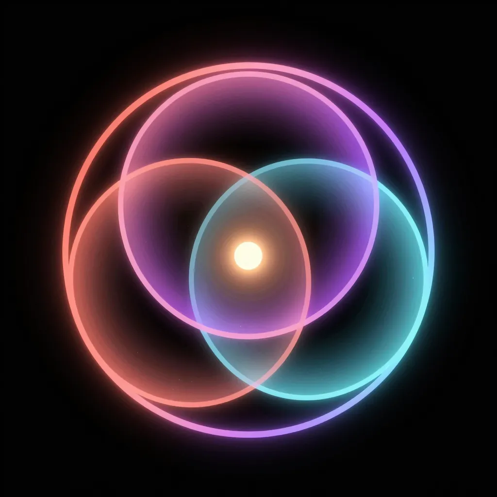
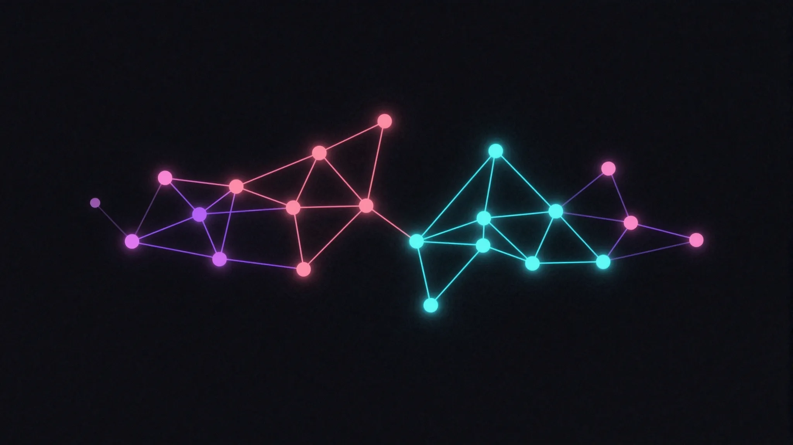

<div align="center">



# OpenBodhi

**Your thoughts accumulate. Patterns emerge. Bodhi watches.**

A local-first personal AI that captures fragmented ideas, discovers connections over time, and surfaces insights when you're ready — not when an algorithm decides you should be.

[](docs/bodhi/ROADMAP.md)
[](https://github.com/openclaw/openclaw)
[](LICENSE)
[](https://growmindspace.substack.com)



</div>

---

## The problem with existing tools

Notion organizes. Obsidian links. Roam backreferences. All of them optimize for output — structured notes, completed tasks, organized knowledge.

None of them watch for patterns in how you *think*.

Ideas don't fail because of lack of organization. They fail because systems don't preserve the state of thinking. The 2am insight fades. The recurring theme never surfaces. The connection between two separate thoughts from three months apart never gets made.

OpenBodhi is different. You drop a thought. Bodhi files it. Over time, patterns emerge from your own data. When a cluster of ideas reaches readiness — not by calendar, but by weight — Bodhi surfaces it quietly.

No prompts. No dashboards. No streak tracking. Just your mind, mapped.

---

## How it works

Built on [OpenClaw](https://github.com/openclaw/openclaw) — a local-first personal AI gateway with multi-channel messaging and a full skills system. OpenBodhi adds a wellness-focused knowledge layer on top: a vault of typed nodes, four autonomous workers, and a model of cognition borrowed from physics.

**The science behind it:**

- **Self-Organized Criticality** (Per Bak, 1987) — ideas accumulate energy silently until a cluster reaches a critical state. The sandpile model applied to human cognition. No forced deadlines. Readiness emerges.
- **Spaced repetition** (Ebbinghaus) — high-energy un-acted ideas surface at optimal intervals. Not reminders. Mirrors.
- **HDBSCAN clustering** — density-based pattern discovery without pre-specifying how many clusters exist. Your thinking decides the structure.
- **Betweenness centrality** — identifies bridge ideas: thoughts connecting otherwise-unrelated clusters.

**Zero-friction capture:**

```
You: "rest is not laziness — I keep forgetting this"

Bodhi: "✓"
```

That's it. No forms. No energy ratings. No follow-up questions. Bodhi infers energy from language. The thought is filed, classified, embedded, and waiting.

**What happens next:**

| Worker | When | What it does |
|--------|------|-------------|
| **Curator** | Every message | Classifies thought, infers energy, writes node to vault |
| **Distiller** | 6am daily | Synthesizes last 7 days, surfaces energy trajectories, sends digest |
| **Janitor** | Sunday 3am | Detects orphans + duplicates, requests human approval before touching anything |
| **Surveyor** | Saturday 2am | HDBSCAN clustering, bridge discovery, Synthesis nodes, "message from past self" |

**The vault is yours:**

```
vault/
├── nodes/2026-03/{uuid}.json    ← one file per thought
├── edges/{uuid}.json            ← typed relationships
└── schema/                      ← JSON Schema validation
```

Local filesystem. Never synced. Never indexed externally. Anthropic receives message text for classification — nothing else.

---

## Vault ontology

Six node types. Six edge types. Built to model how ideas actually move.

| Node | Color | What it is |
|------|-------|-----------|
| **Idea** | `#d4941a` | Raw insight. The thought as it arrived. |
| **Pattern** | `#cca329` | Recurring theme. Distiller surfaces these. Cannot be created directly. |
| **Practice** | `#5a8a75` | Something you do intentionally. Crystallizes from Idea or Pattern. |
| **Decision** | `#508cb4` | A choice made, with context. Answers "what did I choose and why?" |
| **Synthesis** | `#8c64aa` | AI-discovered connection. Surveyor's output. Bridge node. |
| **Integration** | `#558c55` | An insight you have embodied. Rarest type. Only humans assign this. |

---

## Roadmap

```
Phase 0 — Foundation          ← you are here
  Fork OpenClaw, full architecture docs, vault schema, skill specs

Phase 1 — Local Gateway
  OpenClaw running on dedicated Ubuntu machine, Telegram connected

Phase 2 — Curator
  Real-time thought capture. Zero friction. Vault fills.

Phase 3 — Vault layer
  packages/bodhi-vault/ — shared read/write module, ChromaDB embeddings

Phase 4 — Distiller
  6am daily digest. Energy trajectories. Pattern candidates.

Phase 5 — Janitor + Surveyor
  HDBSCAN clustering. Bridge discovery. Message from past self.

Phase 6 — Nudge system
  SOC-based readiness detection. Alfred/SiYuan integration.
```

---

## Architecture

```
Telegram
   ↓
OpenClaw Gateway  (ws://127.0.0.1:18789 — localhost only)
   ↓
Bodhi Skills      (Curator · Distiller · Janitor · Surveyor)
   ↓
vault/            (local filesystem — never leaves your machine)
   ↓  (message text only)
Anthropic API     (classification, synthesis, digest composition)
```

**Security model:**
- Gateway binds to `127.0.0.1` only — not internet-exposed
- Telegram whitelist — only the owner's user ID accepted
- Vault files: `chmod 700`, owned by `bodhi` OS user
- No cloud sync, no remote storage of vault data
- Anthropic receives message text for classification only — not your graph structure

---

## Follow the build

OpenBodhi is being built in public. Every phase is documented on Substack as it ships.

**[growmindspace.substack.com](https://growmindspace.substack.com)**

This is Phase 0. The architecture is complete. The vault schema is specified. The skill specs are written. The code begins in Phase 1.

---

## Stack

- **Runtime:** Node.js 22+, TypeScript 5.x
- **Package manager:** pnpm
- **Gateway:** [OpenClaw](https://github.com/openclaw/openclaw) (MIT)
- **AI:** Claude Opus 4.6 (synthesis) · Claude Sonnet 4.6 (classification)
- **Embeddings:** nomic-embed-text via Ollama (local, zero API cost)
- **Vector store:** ChromaDB (embedded mode)
- **Clustering:** HDBSCAN (Python subprocess)
- **Messaging:** Telegram via OpenClaw's Grammy adapter

---

## Built on OpenClaw

OpenBodhi is a fork of [openclaw/openclaw](https://github.com/openclaw/openclaw) — a 277k-star open-source personal AI gateway. OpenClaw provides the infrastructure: multi-channel messaging, WebSocket gateway, skills system, Docker deployment. OpenBodhi adds the wellness knowledge layer on top.

All OpenClaw upstream improvements are inherited. Bodhi-specific changes live exclusively in `skills/bodhi-*/` and `packages/bodhi-vault/`.

---

## License

MIT — same as OpenClaw upstream.

---

<div align="center">
<sub>Built by <a href="https://qenjin.io">Qenjin.io</a> · Ideas reach their own readiness.</sub>
</div>
